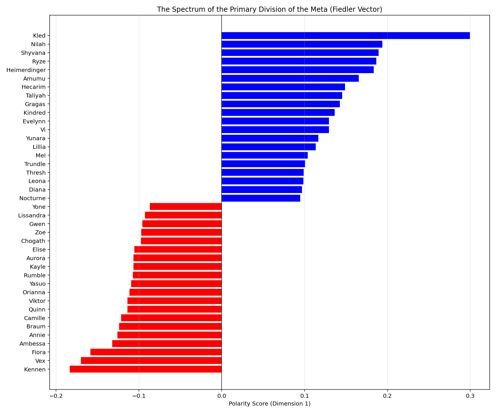
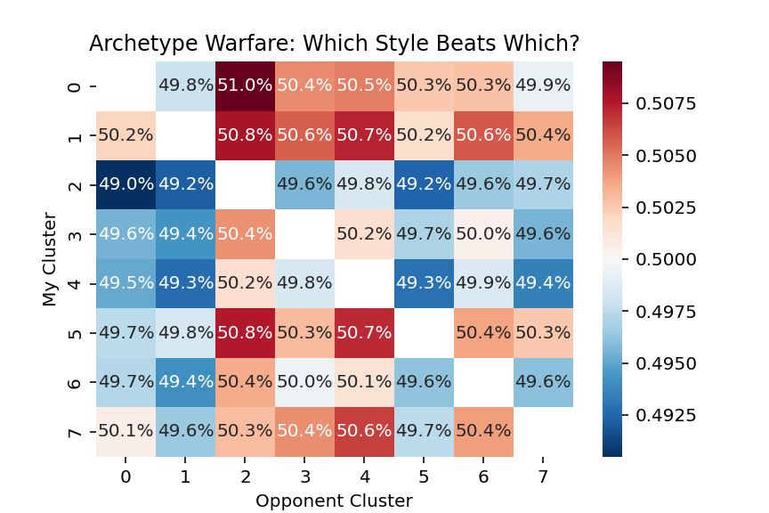
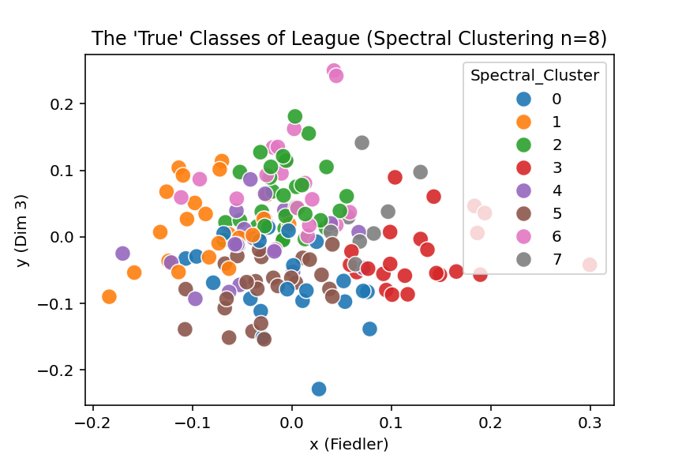
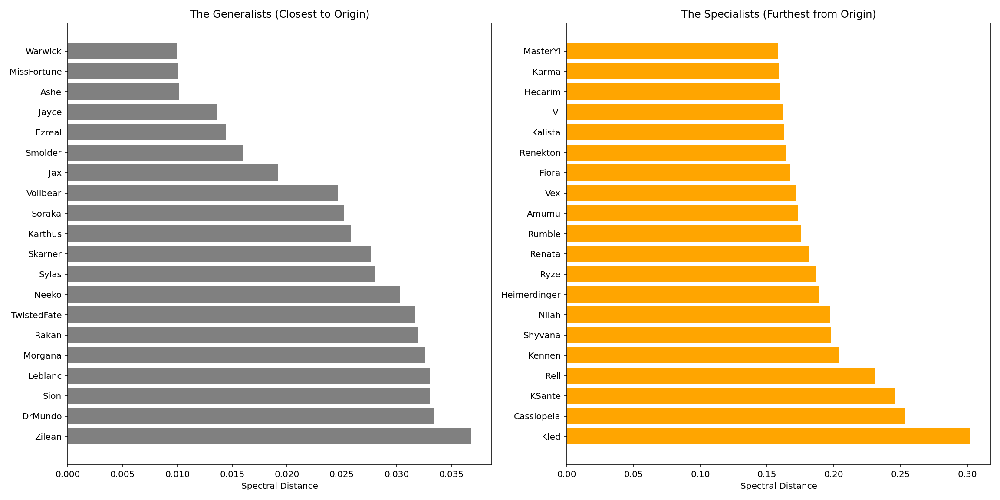
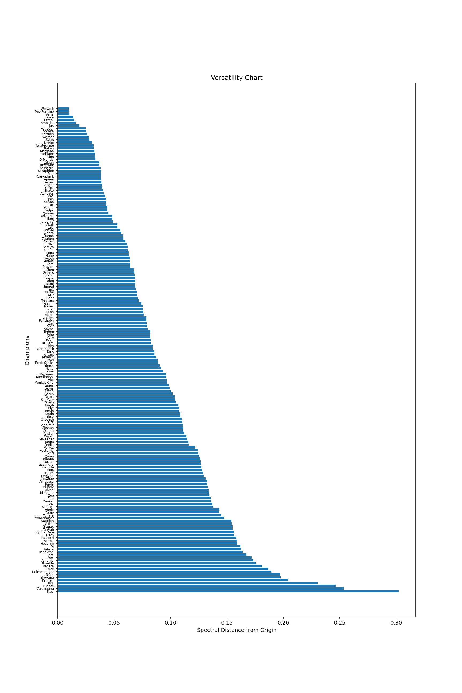
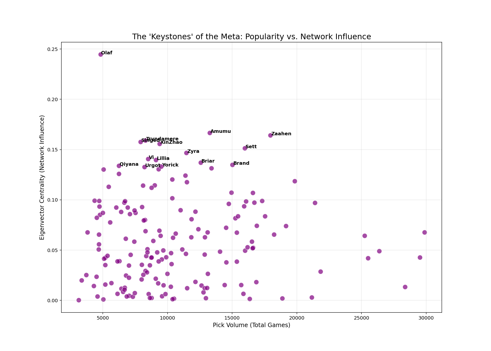

# The Topology of the Meta: Spectral Graph Theory in League of Legends

## Project Overview
This project applies **Spectral Graph Theory** to a dataset of **185,000+ Ranked Matches** from Season 15 in North America to mathematically illustrate the structure of the League of Legends meta.

Instead of accepting Riot Games' predefined roles (Mage, Fighter, Tank), this project constructs a "Synergy Graph" based on statistical lift. By computing the **Graph Laplacian** and extracting its **Eigenvectors**, we can uncover hidden "Draft Archetypes" and the fundamental mathematical divides of the game.

## Key Findings

### 1. The "Agency Theory" (The Fiedler Vector)
The Fiedler Vector (2nd Eigenvector) finds the "easiest" way to split a network. In this case, I found the Fiedler Vector of the Graph Laplacian of a Synergy graph, and it appears splits the graph by **Agency Location**:
* **Negative Pole (Lane Kingdom/Scale and Split):** Champions who demand resources to win a static 1v1, lane bullies who want to translate their won lane into won games.  
We observe various champion archetypes present in this pole. Kennen, Vex, Annie, Braum, Quinn, Viktor, Orianna, Yasuo, Rumble, Aurora, Elise, Zoe, and Lissandra are all champions whose primary gameplan is to bully their opponent during laning phase, and to translate their lead into solo kills, priority in early objective skirmishes, and generally early leads to push for victory on their own. Fiora, Ambessa, Camille, Kayle, Cho'Gath, Gwen, and Yone are comparatively weak champions early, but are likewise able to take the game into their own hands with significant scaling and sidelane (split-pushing) pressure. This pole combines strong laning phases with champions that seek to draw attention to other places of the map, so that the laners who ideally would become fed can dominate teamfights while someone has to deal with a splitpusher.
* **Positive Pole (Map Pressure/Cooperative Dive):** Champions who sacrifice some lane dominance in order to impact the global map, and champions who excel at diving in, especially with supporting teammates.  
We also observe various archetypes present in this pole. Kled, Ryze, Taliyah, and Nocturne all have semi-global ultimate skills that allow them to join fights from afar. They want to play for turning 1v1 skirmishes into 2 or even 3 v 1s, and use those sudden numbers shifts to win fights and accordingly win games. Nilah, Shyvana, Amumu, Hecarim, Gragas, Vi, Leona, and Diana all have incredibly strong dive abilities, and rely on their teammates to follow up and assist in the dive. Heimerdinger, Kindred, Yunara, Mel, all excel at following up on dives, either with range or speed/dashes. Evelynn, Thresh, and Lillia are famous for their high roaming utility (Evelynn's invisibility, Thresh's long range get-out-jail card and conditional dash, and Lillia's incredible map movement speed and ability to take the center stage in fights and quickly kite out). The odd one out of this pole would be Trundle. Intuitively, he appears to actually fit better in the negative pole, but perhaps this is due to my personal misperception in how he is played. Perhaps the map movement and long range utility of the pillar tend to outweigh his incredible scaling and splitpushing power? Or the influence of split-pushing on map pressure is the defining feature of Trundle? I suppose it is up for debate. In summary, this pole combines global pressure with excellent dive and follow-up for executing very strong mid-to-late-game teamfights to push for victory.

  

### 2. Draft Archetypes (K-Means Clustering)
Using the synergy graph and K-Means clustering with 8 clusters, I was able to split champions into 8 distinct "draft archetypes," ecosystems wherein the champions between different roles have powerful synergistic effects with each other. Let's take a look at every cluster.
* **Cluster 0: Zone Control Comp**
  * **Top:** Garen, Gwen, Singed, Wukong, Sion, Skarner, Tahm Kench, Warwick, Zac
  * **Jungle:** Gwen, Karthus, Wukong, Skarner, Warwick, Zac, Zyra
  * **Mid:** Akshan, Aurora, Lux, Swain
  * **ADC:** Corki, Karthus, Lux
  * **Support:** Alistar, Janna, Karma, Lux, Nautilus, Rell, Swain, Tahm Kench, Zac, Zyra
  * Many of the champions in this cluster possess either sprawling AoE damage/control (such as Aurora, Karthus, Lux, Singed, Swain, Zyra, Karma, and Janna), "impassable" presences (Alistar, Gwen, Karthus W, Nautilus, Rell, Sion, Skarner, Tahm Kench, Zac), or powerful and quick execution of a flank (Akshan, Corki, Garen, Wukong, Warwick, and many of the former section's tanks who similarly have powerful engage tools) or combinations of these categories. The win condition of this cluster is relatively clear, the AoE damage core wants to set up around an objective and establish themselves, zoning away enemies with AoE damage abilities like Zyra's plants, Singed's poison, Karthus' wall and Qs, Lux abilities, or Swain's zoning tools. Champions like Corki, Akshan, Garen, Wukong, and others hide in stealth or out of vision before ambushing an unsuspecting target that has to walk up. The impassable presences like Alistar, Sion, or Gwen stand in front of their teams, ignoring poke and allowing them to safely control zones to secure objectives. This cluster is one of the strongest, only slightly beat out by the hard engage dive comp in the archetype warfare chart below.
* **Cluster 1: The All-In Wombo Combo Dive Comp**
  * **Top:** Ambessa, Cho'Gath, Fiora, Jax, Kennen, Malphite, Quinn, Urgot, Yasuo, Yone
  * **Jungle:** Ambessa, Brand, Cho'Gath, Elise, Jax, Malphite, Rengar
  * **Mid:** Annie, Galio, Hwei, Malphite, Quinn, Viktor, Xerath, Yasuo, Yone
  * **ADC:** Brand, Hwei, Sivir, Viktor, Xerath, Yasuo, Zeri
  * **Support:** Annie, Brand, Braum, Elise, Galio, Hwei, Lulu, Xerath
  * This cluster is clearly defined by two distinct groups of champions: the hard and easy dive engagers (Ambessa, Kennen, Malphite, Urgot, Elise, Galio, Annie, Braum), and the masters of following up with enough damage and support to clean up the engage (Jax, Quinn, Yasuo, Yone, Brand, Elise, Rengar, Galio, Hwei, Viktor, Xerath, Sivir, Zeri, Lulu). Some champions like Fiora or Cho'Gath don't seem to fit in either category, but Fiora's ability to force attention to her splitting and Cho'Gath's powerful ultimate do contribute to the overall power of a dive. The win condition this cluster is perhaps the most obvious, simple hard engage, with simple, strong followup to win key fights and win the game. The dive comp appears to be the strongest in the game, being the only cluster with a positive winrate against every other one in the archetype warfare chart. This is likely attributable to general ease of execution with clearly strong results. Dive compositions particularly define the pro-play meta, so we would expect to see them strongly represented here. 
* **Cluster 2: The Siege and Trap Comp**
  * **Top:** Briar, Darius, Gangplank, Gnar, Illaoi, Jayce, Pantheon, Vladimir
  * **Jungle:** Briar, Darius, Ivern, Kayn, Naafiri, Nunu, Pantheon, Qiyana, Udyr, Xin Zhao
  * **Mid:** Azir, Fizz, Jayce, LeBlanc, Malzahar, Naafiri, Pantheon, Qiyana, Twisted Fate, Vel'Koz, Vladimir, Zilean
  * **ADC:** Ashe, Ezreal, Kai'Sa, Miss Fortune, Senna, Seraphine
  * **Support:** Blitzcrank, Ivern, LeBlanc, Pantheon, Rakan, Renata Glasc, Senna, Seraphine, Sona, Vel'Koz, Zilean
  * This cluster is one of the more difficult ones to properly assign a label. There are a few distinct groups of champions, such as "bait" champions who excel in sieging and "artillery" gameplay (Gangplank, Ranged Gnar, Ranged Jayce, Blue Kayn, Azir, Ranged Jayce, LeBlanc, Twisted Fate, Vel'Koz, Ezreal, Kai'Sa, Seraphine), the "spike" champions who discourage hard engage, demanding enemies to run away (Briar, Darius, Gangplank, Melee Gnar, Illaoi, Melee Jayce, Vladimir, Red Kayn, Nunu, Udyr), the "trigger" champions who force interaction and follow up with burst and chase if the bait doesn't work (Pantheon, Naafiri, Qiyana, Xin Zhao, Fizz, Melee Jayce, Malzahar, Twisted Fate, Ashe, Miss Fortune, Blitzcrank, LeBlanc, Rakan), and the "safety valve" champions who can skillfully disengage or help the squishier elements of the team get to safety (Ivern, Azir, Twisted Fate, Zilean, Senna, Seraphine, Rakan, Renata, Sona). In general, this draft archetype feels like one of the least cohesive. While it has a theoretically justifiable premise, to an extent it feels like a "jack of all trades, master of none" draft. The supposed win condition would be to win through attrition, sieging towers or controlling a zone, baiting with the long range damage, and closing the trap on those who step too far. But, the relative weakness of this archetype is clearly illustrated in the archetype warfare chart, where Cluster 2 doesn't have a positive winrate vs. any other cluster. This may be attributable to the lack of patience present in the low-communication environment of solo-queue.
* **Cluster 3: Global Map Pressure Comp**
  * **Top:** Gragas, Heimerdinger, Kled, Trundle, Yorick
  * **Jungle:** Amumu, Ekko, Evelynn, Gragas, Hecarim, Kindred, Lee Sin, Lillia, Nocturne, Shyvana, Taliyah, Trundle, Yorick
  * **Mid:** Ekko, Gragas, Heimerdinger, Mel, Ryze, Taliyah
  * **ADC:** Nilah, Mel, Tristana, Twitch, Yunara
  * **Support:** Amumu, Gragas, Leona, Thresh
  * This cluster is clearly made distinct by its overwhelming prevalance of semi-global ultimate skills (Kled, Nocturne, Taliyah, Ryze), extremely quick map-movement and split pushing power (Trundle, Yorick, Amumu, Ekko, Hecarim, Kindred, Lee Sin, Lillia, Tristana, Yunara), powerful roaming (Gragas, Evelynn, Twitch, Leona, Thresh), and a few stragglers who seem to synergize well with champions like Kled who need everyone to go in (Shyvana, Nilah). Many of these champions are cross compatible with the various categories I've laid out. While Heimerdinger appears visually distinct from the other globally present champions, structurally he acts as the ultimate weakside anchor. He enables global map play by being able to hold his own zone without global help. The win condition here is to turn any random skirmish into an unfair 2 or 3 vs 1. It is to shadow the splitpushers, and make them unpunishable. Champions like Lillia, Hecarim, Tristana, Yunara Amumu, Lee Sin can race across the map, hopping over walls and utilizing their speed to have a global presence. Twitch and Evelynn can navigate the map entirely unseen. This is clearly the "win through macro" teamcomp. It's performance seems relatively average across the board, slightly losing to most comps, likely due to the difficulty of execution a map pressure comp in a game with limited communication. In theory, these playstyles synergize really well and could be one of the strongest.
* **Cluster 4: Pick and Delete Comp**
  * **Top:** Akali, Camille, Poppy, Rek'Sai, Shen, Zaahen
  * **Jungle:** Fiddlesticks, Graves, Jarvan IV, Kha'Zix, Poppy, Rammus, Rek'Sai, Sejuani, Sylas
  * **Mid:** Akali, Kassadin, Sylas, Syndra, Vex, Zoe
  * **ADC:** Aphelios, Kog'Maw, Syndra
  * **Support:** Camille, Fiddlesticks, Poppy, Yuumi
  * This cluster features a striking number of champions who excel at isolating one (or more) target and killing them or setting them up to be killed (Akali, Camille, Poppy, Rek'Sai, Fiddlesticks, Jarvan IV, Kha'Zix, Rammus, Sejuani, Kassadin, Syndra, Vex, Zoe), coupled with strong supporters to join the isolater in the fray (Shen and Yuumi), and some other strong sources of very high burst damage (Graves, Sylas, Aphelios). Kog'Maw and Zaahen are the odd ones out here, with Kog'Maw feeling more appropriate in Cluster 6, but we could also apply the principle of the team singling out one enemy to also apply to singling out attackers after Kog'Maw, as the sole "President" of the composition. As a new release, Zaahen has not yet been able to form strong stable connections. This team's win-condition is fully clear, isolate a key, fed target, take them out instantly, and use the numbers advantage to win fights to win the game. It is notable however that this comp has the highest bar of difficulty for execution. If a champion like Kassadin or Kha'Zix go in to secure the kill and fail, the team crumbles. It demands perfect timing and mechanical play to execute well, which is likely why it has a negative winrate against all clusters but Cluster 2.
* **Cluster 5: Early Game Lane Kingdom, with Insurance Comp**
  * **Top:** Dr. Mundo, Kayle, Mordekaiser, Nasus, Olaf, Ornn, Renekton, Riven, Rumble, Sett, Teemo, Tryndamere
  * **Jungle:** Dr. Mundo, Mordekaiser, Morgana, Nidalee, Olaf, Zed
  * **Mid:** Kayle, Zed, Ziggs
  * **ADC:** Caitlyn, Draven, Jhin, Lucian, Samira, Varus, Xayah, Ziggs
  * **Support:** Bard, Nami, Taric
  * This cluster might confuse at first glance, because the best scaler in the game, Kayle, along with some other strong scalers like Mundo, Ornn, and Nasus are all on the same team with the most notorious lane bullies in the entire game. This cluster is defined by its two key groups, the lane bullies (Mordekaiser, Olaf, Renekton, Riven, Rumble, Sett, Teemo, Tryndamere, Nidalee, Morgana, Zed, Ziggs, Caitlyn, Draven, Jhin, Lucian, Samira, Varus, Bard, Nami) and the scaling insurance (Dr. Mundo, Kayle, Nasus, Ornn, Xayah, Taric). This team's win condition is to have some role dominate their early game, and to use that advantage to take over the game. A few notorious scalers are huddled in, perhaps because they synergize particularly well with these other champions for some reason that isn't immediately obvious. The strong early game champions give them space to breathe, by demanding the enemy jungler's attention lest they dominate their lane. Notably though, many of these strong early game champs are also known to be strong scalers (like Riven, Zed, Caitlyn, and arguably Olaf). These help define this archetype and give it power. If the early game is strong, its an easy win, if it wasn't as strong as needed, there is some insurance to help it crawl back. The performance of this cluster appears to be a bit above average, winning vs. some clusters, but losing to the dominant Cluster 0 and 1. 
* **Cluster 6: Hyper-scaling Comp**
  * **Top:** Aatrox, Cassiopeia, Irelia, K'Sante, Volibear
  * **Jungle:** Aatrox, Maokai, Volibear
  * **Mid:** Ahri, Aurelion Sol, Cassiopeia, Irelia, Katarina, Lissandra, Neeko, Orianna, Veigar
  * **ADC:** Aurelion Sol, Cassiopeia, Jinx, Kalista, Smolder, Vayne, Veigar
  * **Support:** Maokai, Milio, Neeko, Pyke, Soraka
  * Similar to the previous cluster, this one also confuses with some infamous earlygame powerhouses (Irelia, Volibear, Katarina, Kalista, Pyke) mixed in with late game scaling superstars (Aurelion Sol, Cassiopeia, Jinx, Maokai, Milio, Orianna, Smolder, Soraka, Vayne, Veigar). These are mixed together with some generalist enablers (Aatrox, Ahri, K'Sante, Lissandra, Neeko). This cluster aims to win through having a stable ground in some lane(s) with a consistent enabler or strong early pick, with one or two "inevitable" late game scalers that will take over the game as long as it can stall. The early game champs are the bridge to allow the scalers to cross into the late game. This cluster's performance is similar to Cluster 5, although a bit weaker overall. There is a general consensus that scaling champions should be strong in average ELO, but that isn't fully reflected in the data. This discrepancy suggests that despite the theoretical power of scaling, the pace of the game in the current Season 15 meta possibly ends games before these champions reach their "inevitability" threshold, despite efforts to increase average game length.
* **Cluster 7: The Self-Defined Comp**
  * **Jungle:** Bel'Veth, Diana, Master Yi, Shaco, Talon, Vi, Viego
  * **Mid:** Anivia, Diana, Talon
  * **Support:** Shaco
  * This cluster is the clear oddball. It's almost entirely defined by junglers, specifically, many infamous "1v9" junglers who take the game into their own hands. I suppose the interpretability could be that when any of these champs are locked in, most of the time it is *on them* to figure out how to make their champion work to win the game. These champions all have strong solo-carry potential, but at the cost of not clearly fitting into any of the other clusters. This cluster is systemically isomorphic. Every champion demands the exact same thing: for the team to play around them. When one of these is picked, the draft archetype becomes simply "them." The high winrate suggests that in an uncoordinated environment, a single hyper-fed protagonist is often more effective than complex team synergy.

  

  

### 3. Generalists vs. Specialists
The below chart measures each champion's euclidean distance from the origin when plotted along the first two eigenvectors. We can interpret this distance in the spectral embedding space where champions close to the origin are generalist, with moderate non-negative synergy with most champions, and champions distant from the origin are specialist, with high synergy with a select subset of champions and negative synergy with everyone else. This analysis reveals results that are quite expected: the generalist space is dominated by ADCs who can largely fit into any composition without dragging down other champions, especially those with range and strong kiting abilities. This is coupled with a few bruisers, tanks, and strong engagers that understandably don't demand much of their teammates to function in the game. Conversely, the specialist space is most prominently occupied by Kled, which is very expected as his ultimate demands his teammates to follow up with him at high speed headfirst into the enemy, a strategy which explicitly goes against the gameplan of tons of champions specializing in poke or attrition. This "diver" trend is actually quite dominant in the specialist category, with champions like Vi, Hecarim, Renekton, Vex, Amumu, Nilah, Shyvana, Kennen, Rell, and K'Sante also occupying space. Cassiopeia, as the second furthest champion from the origin, perhaps occupies the position of "I need to stand behind my frontline and freehit" more than any other champion. With an ability like her grounding W, she demands champions that will lock enemies in her "area of doom," compared to a champion like Jinx who can take over the fight once she has a reset, or Kog'Maw whose damage output is so absurd that if enemies can't immediately get on top of him, it is better to just run away. 

  

  

### 4. Eigenvector Centrality
In this chart illustrating eigenvector centrality, we can interpret the Y-Axis as recursive synergy. This is a measure of the combination of the number of champions the champion synergizes with (degree centrality) and how flexible those synergistic partners are (how many champions does that champion synergize with). Using this principle of **Eigenvector Centrality**, I identified **Olaf** as the structural "keystone" of the meta. He has the highest network influence, effectively serving as a bridge between disparate draft archetypes (Dive, Speed, and Enchanter comps, in which he all fits inside). Simply stated, locking in Olaf keeps the draft structurally open. Unlike picking a specialized champion, which forces the team down a specific strategic path, picking Olaf retains the maximum number of high-synergy paths for subsequent picks. You might have noticed that Vi is both a specialist according to spectral distance, but also has high eigenvector centrality. This means that Vi is a specialist in the sense that she struggles to function outside of dive comps, but because dive champions are so prominent and have such strong synergy with one another, she actually ends up having high eigenvector centrality. In fact, a lot of the champions high on the eigenvector centrality chart also function well as divers.

  

## Methodology

### 1. Data Scraping (`src/data_collection.py`)
* Harvested **10,000 Seed Players** using Stratified Sampling to match the true Ranked Distribution (Iron to Challenger).
* Processed **185,000 Matches** via the Riot Games API. (Took several phases of API keys)
* Computed a **Synergy Matrix** using "Lift": $Lift = P(A \cap B) - P(A)P(B)$.

### 2. Spectral Analysis (`src/analysis.py`)
* **Graph Construction:** Built a k-Nearest Neighbors graph ($k=6$) to sever weak noise connections and isolate strong strategic bonds.
* **Laplacian Normalization:** Used the Symmetric Normalized Laplacian: $L_{sym} = I - D^{-1/2}AD^{-1/2}$.
* **Eigendecomposition:** Extracted the bottom $k$ eigenvectors to project the 172-dimensional champion space into a 3D Manifold.

## Usage
1. Install requirements: `pip install -r requirements.txt`
2. Run the analysis: `python src/analysis.py`
*(Note: data_collection.py requires a Riot API key)*

## Tools Used
* **Python**: Pandas, Numpy, Scipy (Linear Algebra)
* **Visualization**: Plotly (3D Interactive), Seaborn, Matplotlib, NetworkX
* **Machine Learning**: Scikit-Learn (K-Means)
* **API**: RiotWatcher
